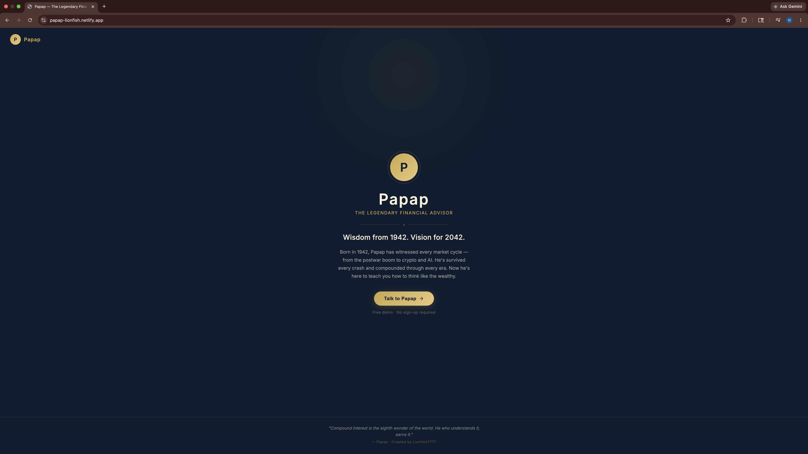

# Papap

We built Papap as a full product concept because we wanted to understand what
it means to give a software product a genuine human point of view. Papap is
not a chatbot. It is a character. A market veteran born in 1942, built to
deliver eighty years of financial wisdom through the intimacy of a text
conversation. The interface is deliberately minimal. No dashboards, no charts.
Just a voice that has survived every crash since the postwar boom, speaking
directly to you.

Powered by Claude and ElevenLabs. Built on React, Node.js, and Express.

## Live Demo

https://papap-lionfish.netlify.app

The live demo shows the landing page and product design. The full experience,
AI responses and Papap's voice, requires the local setup. Follow the Getting
Started instructions below.

## Screenshots



---

## What We Built Into It

**Persona-driven AI.** Papap responds in short, warm, text-message-style
bursts. Warren Buffett's discipline. Bob Proctor's warmth. Never hypes.
Never gambles. Always teaches.

**Deliberate UX rhythm.** Responses split across multiple bubbles with timed
delays, engineered to feel like receiving real texts rather than reading an
API response.

**Voice synthesis.** Every reply is spoken aloud via ElevenLabs
(`eleven_turbo_v2`), streamed directly from the server. When ElevenLabs is
not configured, it falls back to the browser's Web Speech API. Voice is never
optional, only sourced differently.

**Multimodal input.** Users can attach images, documents, or screenshots.
Attachments are encoded and passed to Claude as structured content blocks
alongside the user's message.

**Persistent conversation memory.** The full message history is rebuilt and
sent to Claude on every request, preserving context across the entire session.

---

## Tech Stack

Frontend
- React 18 + Vite
- Components: `ChatWindow`, `ChatInput`, `MessageBubble`, `TypingIndicator`,
  `ReadReceipt`, `LandingPage`
- Axios for API communication

Backend
- Node.js + Express
- Anthropic SDK running `claude-opus-4-6`
- ElevenLabs REST API running `eleven_turbo_v2`, streamed as `audio/mpeg`
- CORS configured for local development

---

## Architecture

```
client/                   # React + Vite frontend
  src/
    App.jsx               # Root — state management, message history, voice orchestration
    components/
      LandingPage.jsx     # Entry screen
      ChatWindow.jsx      # Scrollable message thread
      ChatInput.jsx       # Text input + file/image attachment handler
      MessageBubble.jsx   # Individual message rendering
      TypingIndicator.jsx
      ReadReceipt.jsx

server/                   # Node.js + Express API
  index.js                # Entry point — CORS, middleware, routing
  routes/
    chat.js               # POST /api/chat  — Claude API, system prompt, conversation history
    voice.js              # POST /api/voice — ElevenLabs TTS, streams audio/mpeg to client
```

---

## Getting Started

Prerequisites
- Node.js 18+
- Anthropic API key
- ElevenLabs API key and Voice ID (optional, the app falls back to browser TTS
  without these)

Install and Run

1. Clone the repo
```bash
git clone https://github.com/Lionfish7777/papap-advisor.git
cd papap-advisor
```

2. Start the server
```bash
cd server
npm install
cp .env.example .env
# Fill in your API keys
npm start
```

3. Start the client
```bash
cd client
npm install
npm run dev
```

Client runs at `http://localhost:5173` and server at `http://localhost:5001`

---

## Environment Variables

```env
ANTHROPIC_API_KEY=your_anthropic_api_key
ELEVENLABS_API_KEY=your_elevenlabs_api_key   # optional
ELEVENLABS_VOICE_ID=your_voice_id            # optional
PORT=5001
```

Without ElevenLabs keys, voice routes return a 503 and the client falls back
to the browser's `SpeechSynthesis` API automatically. The persona still
speaks, just through a different channel.

---

## Prompt Engineering

The system prompt is the core of the product. Papap is instructed to respond
in short bursts, lowercase, conversational, unhurried. Occasionally split
across multiple paragraphs to mimic real texting rhythm. Every response ends
with a grounded insight or a small, concrete task.

Client-side, Claude's reply is split at double-newlines and each segment is
rendered as a separate `MessageBubble` with a 600ms stagger, transforming a
single API response into a sequence of arriving texts. The effect is
intentional. It makes the advisor feel present, not instantaneous.

The persona, patience, precision, and earned authority, is held entirely in
the prompt. No fine-tuning. No retrieval. Just language, carefully chosen.

---

## What We Learned

We had built features before. We had never built a character. Papap taught us
that there is a different kind of engineering in giving a product a genuine point
of view. Every technical decision ran through the same question: does this feel
like Papap or does it feel like software. We are avid readers and writers and
that is the kind of problem we want to keep solving.

Multi turn context management was where we understood what a language model
actually needs to stay coherent. Every request rebuilds the full message history
and sends it to Claude. That is not a workaround. That is the architecture.
Earning that understanding meant building it, breaking it, and rebuilding it.
We are newer to this field. That is how we learn.

The timed bubble rendering was where UX became tangible for us in a way it had
not been before. A single API response split across three bubbles with 600
millisecond delays feels like receiving texts from a real person. The same
content delivered instantly feels like reading a document. The engineering behind
it is minimal. What it taught us about rhythm and experience design is not.

---

## Future Improvements

We gave Papap a voice and a personality. The next version is where he gets a memory. When he remembers you, everything changes.

- Database backed conversation history. Right now every session starts fresh. Persistent memory is what turns Papap from a conversation into a relationship.
- Structured document analysis. Users can attach images today. Real support for financial statements, portfolios, and tax documents is the next capability that makes this genuinely useful.
- Subscription model. The product is built for it. The Stripe architecture from TaskFlow Pro applies directly and we are ready to wire it in.
- Custom voice. ElevenLabs supports voice cloning. A voice built specifically for who Papap is would complete the character in a way no off the shelf option can.

---

## Status

Public. Active development. Deployed to Netlify.
